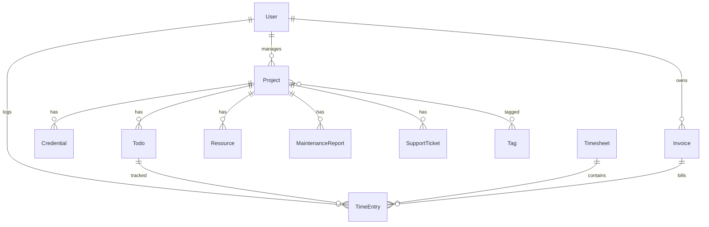

# LSM Platform — Landeseiten Maintenance

> A comprehensive web platform for managing WordPress website maintenance, team coordination, time tracking, and client reporting.

---

## What is LSM?

**LSM (Landeseiten Maintenance)** is an internal management platform designed for web agencies that maintain multiple WordPress websites. It provides a centralized hub for:

- 🌐 **Monitoring WordPress sites** — Real-time health checks, security status, plugin updates
- 👥 **Team coordination** — Assign projects to managers and developers
- ⏱️ **Time tracking** — Track time spent on each project with approval workflows
- 🔐 **Credential vault** — Securely store and share login credentials
- 📋 **Task management** — Todos with priorities, assignees, and file attachments
- 📊 **Invoicing & Reports** — Generate maintenance reports and invoices

---

## Architecture

```
┌─────────────────────────────────────────────────────────────────┐
│                         LSM Platform                            │
├─────────────────────────────────────────────────────────────────┤
│                                                                  │
│   ┌──────────────┐     ┌──────────────┐     ┌──────────────┐   │
│   │   Web SPA    │     │   Mobile     │     │  WordPress   │   │
│   │  (React 18)  │     │   (Planned)  │     │   Plugin     │   │
│   │  apps/web/   │     │  apps/mobile │     │              │   │
│   └──────┬───────┘     └──────┬───────┘     └──────┬───────┘   │
│          │                    │                    │            │
│          └────────────┬───────┴────────────────────┘            │
│                       ▼                                          │
│              ┌────────────────┐                                  │
│              │   REST API     │                                  │
│              │  Laravel 12    │                                  │
│              │  /api/v1/*     │                                  │
│              └────────┬───────┘                                  │
│                       │                                          │
│              ┌────────▼───────┐                                  │
│              │    Database    │                                  │
│              │  MySQL/SQLite  │                                  │
│              └────────────────┘                                  │
│                                                                  │
└─────────────────────────────────────────────────────────────────┘
```

### Tech Stack

| Layer | Technology |
|-------|------------|
| **Frontend** | React 18, TypeScript, Ant Design v5, Tailwind CSS |
| **Backend** | Laravel 12, PHP 8.2+ |
| **Database** | MySQL (production), SQLite (development) |
| **Build** | Vite 7, Turborepo (monorepo) |
| **WordPress** | Custom plugin for site monitoring |

---

## Core Features

### 1. 🌐 Website Health Monitoring

Monitor all managed WordPress sites from a single dashboard.

**Tracked Metrics:**
- WordPress version & update status
- PHP version
- Plugin count & outdated plugins
- SSL certificate status
- Disk space usage
- Security issues

**Status Categories:**
| Status | Meaning |
|--------|---------|
| Online | Site is healthy and accessible |
| Offline | Site is unreachable |
| Maintenance | Site is in maintenance mode |
| At Risk | Security vulnerabilities detected |
| Hacked | Site has been compromised |

### 2. 👥 Team Management

Role-based access control with four user roles:

| Role | Permissions |
|------|-------------|
| **Admin** | Full access, create users, manage billing |
| **Manager** | Manage assigned projects, approve timesheets |
| **Developer** | Work on assigned projects, log time |
| **Viewer** | Read-only access to assigned projects |

### 3. ⏱️ Time Tracking

Complete time tracking workflow:

```
Developer logs time → Submits timesheet → Manager approves → Invoice generated
```

**Features:**
- Timer-based or manual entry
- Link time to specific projects and todos
- Weekly timesheet submission
- Manager approval workflow
- Automatic invoice creation on approval

### 4. 🔐 Credential Vault

Secure password management for all projects:

- Encrypted storage (AES-256)
- Role-based access (only see your projects)
- Shareable links with expiry dates
- Password reveal logging for auditing

### 5. 📋 Task Management (Todos)

Kanban-style task tracking:

- Priorities: Low, Medium, High, Urgent
- Status: Pending, In Progress, Completed
- Assignees (Manager + Developers)
- File attachments
- Time estimates vs actuals

### 6. 📊 Maintenance Reports

Generate professional PDF reports for clients:

- Tasks completed
- Issues found/resolved
- Time spent
- WordPress health status

---

## How It Works

### WordPress Plugin Integration

The **Landeseiten Maintenance Plugin** installed on client sites communicates with the LSM platform:

```
WordPress Site                    LSM Platform
     │                                 │
     │  ◄─── Health Check Request ───  │
     │                                 │
     │  ─── Health Data Response ───►  │
     │                                 │
     │  ◄─── SSO Login Token ────────  │
     │                                 │
     │  ◄─── Enable Maintenance ─────  │
     │                                 │
```

**Available Remote Actions:**
- One-click WordPress admin login (SSO)
- Toggle maintenance mode
- Clear cache
- Update plugins/themes
- Emergency recovery mode

### API Endpoints

All communication uses the REST API at `/api/v1/`:

| Endpoint | Description |
|----------|-------------|
| `/dashboard` | Stats and recent issues |
| `/projects` | CRUD for projects |
| `/projects/{id}/rmb/*` | WordPress remote management |
| `/credentials` | Secure credential storage |
| `/vault` | Global credential view |
| `/time-entries` | Time logging |
| `/timesheets` | Weekly submissions |
| `/invoices` | Billing management |
| `/todos` | Task management |

---

## Project Structure

```
ManagmentApp/
├── app/                    # Laravel backend
│   ├── Http/
│   │   ├── Controllers/
│   │   │   ├── Api/V1/     # REST API controllers
│   │   │   └── Auth/       # Authentication
│   │   └── Resources/      # API transformers
│   ├── Models/             # Eloquent models
│   └── Services/           # Business logic (LsmService, RmbService)
│
├── apps/
│   ├── web/                # React SPA frontend
│   │   └── src/
│   │       ├── features/   # Feature modules
│   │       ├── lib/        # API client, utilities
│   │       └── components/ # Shared components
│   └── mobile/             # React Native (planned)
│
├── packages/               # Shared monorepo packages
│   ├── api-client/         # TypeScript API client
│   ├── types/              # Shared TypeScript types
│   └── utils/              # Shared utilities
│
├── routes/
│   ├── api.php             # REST API routes
│   └── web.php             # Minimal web routes
│
└── wordpress-plugin/       # WP plugin for site monitoring
    └── landeseiten-maintenance/
```

---

## Running the Application

### Development

```bash
# Backend (Laravel)
composer install
php artisan serve --port=8000

# Frontend (React)
cd apps/web
npm install
npm run dev
```

### URLs
- **Frontend**: http://localhost:3000
- **Backend API**: http://localhost:8000/api/v1

### Test Credentials
| Email | Password | Role |
|-------|----------|------|
| admin@landeseiten.de | password | Admin |

---

## Database Models



---

## Security

- **Authentication**: Laravel Sanctum (SPA tokens + API tokens)
- **Authorization**: Role-based policies
- **Passwords**: AES-256 encryption at rest
- **Audit**: Activity logging for sensitive actions
- **Sessions**: Secure cookie-based for web, Bearer tokens for API

---

## License

Proprietary — Landeseiten.de © 2026
